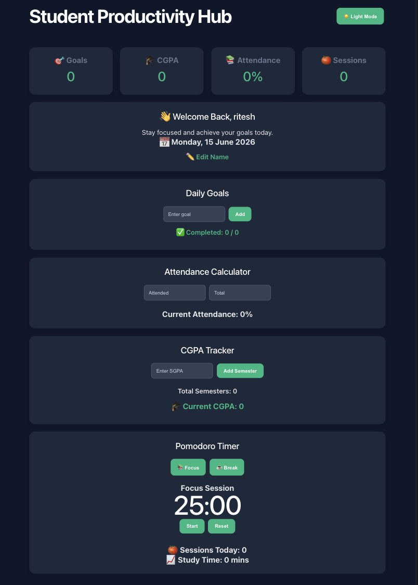

# 🎓 Student Productivity Hub

A modern React-based productivity dashboard designed to help students stay organized, track academic performance, and improve study productivity.

## 🚀 Live Demo

https://student-productivity-hub-one.vercel.app

## ✨ Features

### 🎯 Goal Tracker

* Add and manage daily goals
* Mark tasks as completed
* Track daily progress

### 📚 Attendance Calculator

* Calculate attendance percentage instantly
* Safe Zone / Warning insights
* Attendance statistics tracking

### 🎓 CGPA Tracker

* Add semester-wise SGPA
* Automatic CGPA calculation
* Persistent local storage support

### 🍅 Pomodoro Timer

* Focus and Break modes
* Session tracking
* Study time analytics
* Productivity monitoring

### 🌙 Dark Mode

* Modern light and dark themes
* Smooth theme switching

### 💾 Data Persistence

* Uses Local Storage
* Automatically saves user data
* Restores data after refresh

## 📸 Dashboard Preview

## 🛠️ Tech Stack

* React.js
* Vite
* JavaScript (ES6+)
* CSS3
* Local Storage API

## 🎯 Future Improvements

* Exam Countdown
* Study Streak Tracker
* Notes Section
* Weekly Analytics Dashboard
* User Authentication

## 👨‍💻 Author

**Ritesh Tiwari**

B.Tech Computer Science Engineering (2024–2028)

GitHub: https://github.com/riteshh-99
